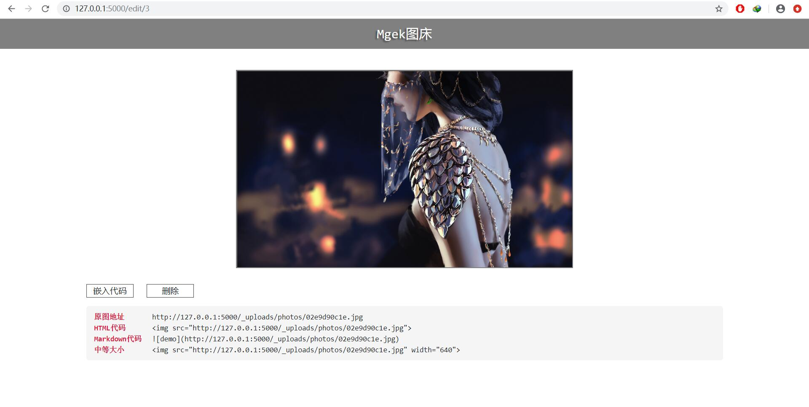
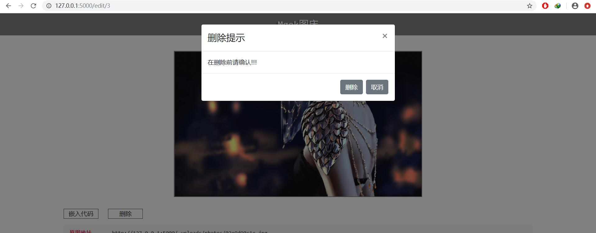
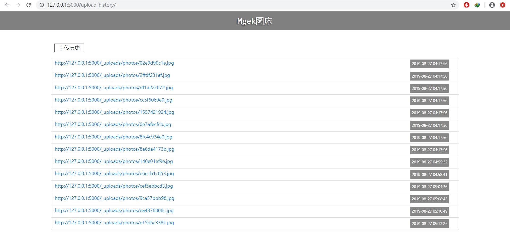

# mgekimghost
mgek图床项目，一个flask简易图床

## 介绍

基于flask1.0.3，sqlite数据库开发，需要可以在配置文件中切换为**mongoDB**
一款小型本地化图床，所有服务基于本地没有连接公共图床服务，支持多文件上传，图片预览，图片编辑，批量删除，批量下载，图片直链生成

### 🕓未完成

- 使用ajax异步上传，同时添加上传进度条
- 图片上传后的直链获取框
- 多文件上传后的直链获取
- 多张图片的删除功能(基本完成)
- 图片的信息记录
- 移动设备的图片自适应问题(待优化)

### 🔵使用

```bash
git clone https://github.com/Landers1037/mgekimghost.git
```

```bash
pip install -r requirements.txt
python app.py
#### if linux with nginx&gunicorn ###
sh start.sh
```

查看本地端口[5000](http://127.0.0.1:5000)

`start.sh`内容

```bash
#! /bin/bash
nohup gunicorn -w 2 -b 127.0.0.1:5000 --reload app:app &
echo "check port 5000"
```

需要在nginx上配置监听5000端口

### 🔷示例

主页面


上传


批量编辑


图片详情页



删除



上传历史



### ♻自定义

数据库

```python
SQLALCHEMY_DATABASE_URI = 'sqlite:///' + os.path.join(os.getcwd(), 'img.db')
```

默认为sqlite，可以注释掉这一句，添加mongoDB数据库

### ™版权

演示图片出自<strong style="color:royalblue">wlop</strong>
本应用作者<strong style="color:royalblue">Landers</strong>
我的主页<a href="http://lrenj.top">Landers1037</a>

